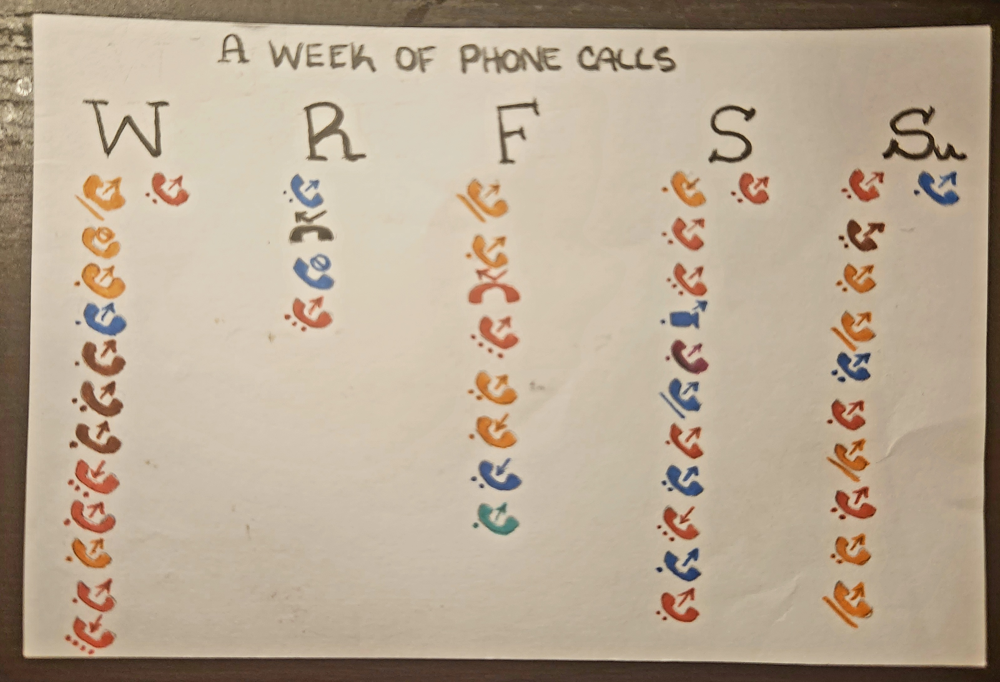

# Project 1: Dear Data

The purpose of this project is to gain experience with collecting "small" data and considering humanistic visualizing techniques.

## A Week of Phone Calls*

I've found, since moving to Chicago for the MS-CAPP program, that I rely on different forms of communication to stave off any homesickness, so I decided to illustrate a "week's" (really 5 days') worth of phone calls.

 ** Disclaimer: this is not representative of how much I like the people I'm calling. ** 

---

### Legend

